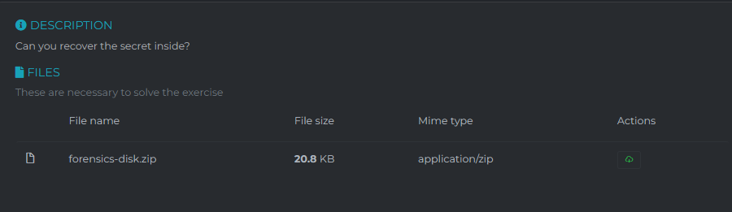
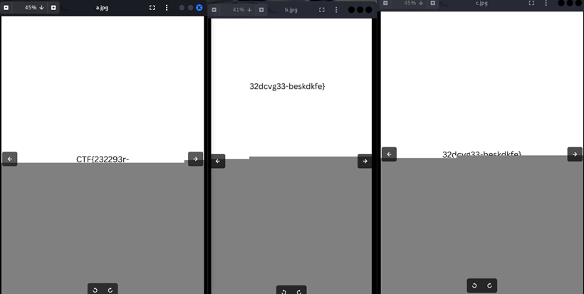

The 3 “disk images” given are actually jpg files (you can check by using `file <filename>`). Changing the extension to `.jpg` we can see that:

Now looking at the metadata of the files with `exiftool` we can also see that the first and last image have the title “Your paragraph text – 1” and “Your paragraph text – 2” respectively. So just put together the first and last picture to get the flag.

`CTF{232293r-32dcvg33-beskdkfe}`

