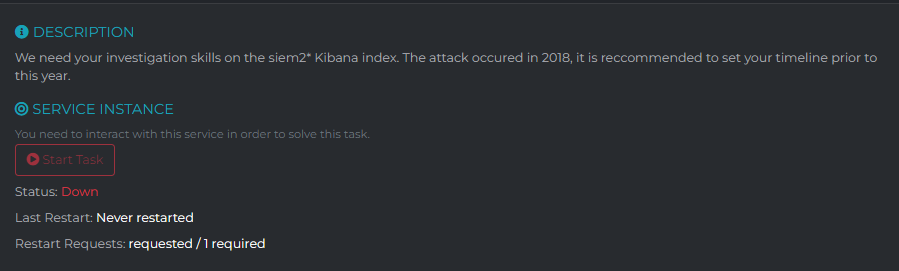
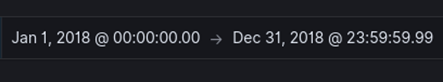

Since we know that the attack occurred in 2018, I set the right time frame and selected the correct index:

After playing around with the filters, I decided to use the `hosts: *` filter, which will match any log that has a non-empty hosts field. This filter only showed 220 hits, and I manually checked some host name from these hits, until I found “studentvisaconsultantsdelhi”. Since the second questions stated that the attacker targeted students, this was what we are looking for. In this log, we can also find the malicious IP in the destination_ip field and the web content management solution exploited in the payload_data field `wordpress_test_cookie=WP+Cookie+check`.
1) Provide the malicious IP -> `103.53.43.239`
2) Considering that the attackers also targeted students, provide the malicious domain used in the attack. (Flag format: domain only eg: google, facecbook) -> `studentvisaconsultantsdelhi`
3) Which web content management solution was exploited during he attack? -> `wordpress`
